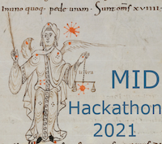

# HC MID Hackathon 2021

<<<<<<< HEAD

<h2>Saturday, May 1, 2021</h2>

=======

<h2>Coming soon</h2>

>>>>>>> 5fea8c90b73b91f18a42c418fcc0003e9377d35b

<<<<<<< HEAD
Welcome to home page for Holy Cross MID Hackathon 2021 - our first online hackathon event!

Our text this year will be the *Aratus Latinus* from the manuscript St. Gallen Stiftsbibliothek 250.  You can find out more about our manuscript on the [e-codices website](https://www.e-codices.unifr.ch/en/searchresult/list/one/csg/0250).

### Summary of our schedule

- Friday afternoon, Apr. 30:  drop-in to MID's regular Friday Zoom meeting for a tech checkup.  We can help you install or configure any software you need help with.
- Saturday  morning, May 1: walk-through of our new editing system with interactive notebooks to validate your editing!
- Saturday afternoon, May 1: you'll work with one or more current MID students to edit a selection from our manuscript.

### Technical preparation

You can participate in our hackathon in either of two roles:

1. *Contributing editors* can work entirely in a web browser.  In addition, you can have a little more flexibility in your participation if you download the text editor we use to collaborate remotely, [Visual Studio Code](https://code.visualstudio.com/download)
2. *Hosts*: in addition to a web browser, hosts should install [Visual Studio Code](https://code.visualstudio.com/download), and the [Julia](https://julialang.org/downloads/) language. That's it!

TBA:  full details of how to configure VS Basic

=======
This is the home page for Holy Cross MID Hackathon 2021 - our first online hackathon event!

We will post initial information here on Monday, April 12, including:

- schedule
- background information about this year's manuscript
- how to register

Stay tuned!
>>>>>>> 5fea8c90b73b91f18a42c418fcc0003e9377d35b
